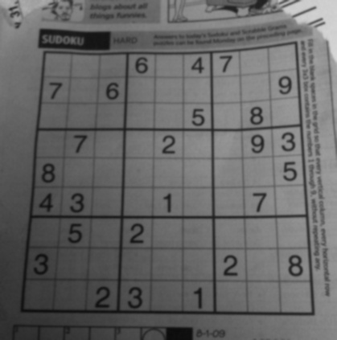
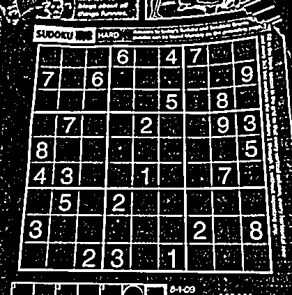
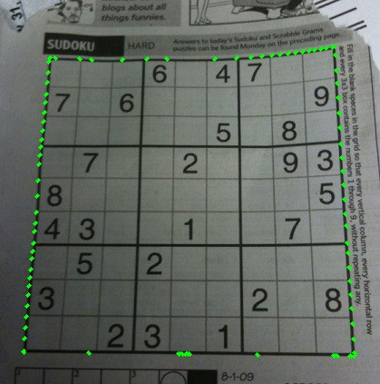
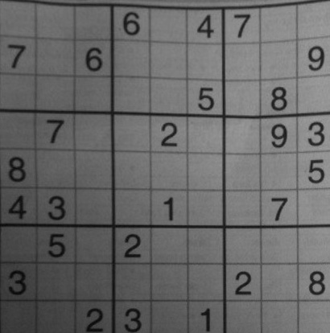

# Sudoku AI
Finding a solution, in real-time, to a Sudoku puzzle using **Computer Vision**, **Neural Networks**, and the **Backtracking Algorithm** with constraint propagation.

## Table of Contents
1. [Introduction](#Introduction)
2. [Prerequisites](#Prerequisites)
3. [Usage](#Usage)
4. [Procedure](Procedure)
5. [Resources](Resources)

## Introduction
Sudoku is a combinatorial number-placement puzzle in which the goal is to fill a 9×9 grid with digits such that every square in each column, row, and box 
(3×3 subgrids) that compose the grid are filled with a permutation of the digits 1 to 9.

## Prerequisites

### Python
This project was written in Python version 3.7.7.

### OpenCV
OpenCV is open source computer vision library that includes functions primarily aimed at real-time computer vision.

### TensorFlow
TensorFlow is an open-source software library for machine learning, primarily focused on training and inference of deep neural networks.

To install all dependencies, run ```pip install -r requirements.txt```

## Usage
To run this project, clone the repository 
```
git clone https://github.com/victor-hugo-dc/Sudoku.git
```
and run
```
python3 main.py
```

## Procedure
1. **Image Processing**\
1.1 Gaussian Blur: Apply Gaussian smoothing to reduce image noise.
    ```python
    result = cv2.cvtColor(frame.copy(), cv2.COLOR_BGR2GRAY)
    result = cv2.GaussianBlur(result, (9, 9), 1)
    ```
    We convert the frame to grayscale and then apply a Gaussian blur with a kernel size of (9, 9).

    1.2 Adaptive Threshold: Segment the regions in the image to identify the puzzle.
    ```
    result = cv2.adaptiveThreshold(result, 255, cv2.ADAPTIVE_THRESH_GAUSSIAN_C, 1, 11, 2)
    ```
    <p align = "center">
        
        
    </p>
    <i>Left: Gaussian Blur applied to a Sudoku puzzle to reduce noise.</i>
    <i>Right: The application of an adaptive threshold on the image.</i>

    After we have processed the image we can begin to extract the Sudoku puzzle from the image.

2. **Sudoku Puzzle Extraction**\
    2.1 Find Contours, assume the largest four-side contour is the Sudoku puzzle.\
    We do this by first finding all of the contours via OpenCV's `findContours()` method.
    ```python
    contours, _ = cv2.findContours(process_image(frame), cv2.RETR_EXTERNAL, cv2.CHAIN_APPROX_SIMPLE)
    ```
    Once we have found the contours, we want to find the largest four side contour that has a large enough minimum area.
    ```python
    def extract_largest_contour(contours: list, min_contour_area: int = 20000) -> np.ndarray:
        for c in sorted(contours, key = cv2.contourArea, reverse = True)[:10]:
            peri = cv2.arcLength(c, True)
            approx = cv2.approxPolyDP(c, 0.02 * peri, True)

            if len(approx) == 4 and cv2.contourArea(c) >= min_contour_area:
                return approx
        
        return None
    ```
    If the contour matching this description is not found, then it is assumed that the board is not in frame. 
    <p align = "center">
        
    </p>
    <p align = "center">
        <i>Figure: The largest four sided contour outlined in green.</i>
    </p>

    2.2 Find the coordinates of the corners of the contour found in the previous step.
    ```python
    def extract_corners(pts: np.ndarray) -> np.ndarray:
        pts = pts.reshape((4, 2))
        rect = np.zeros((4, 1, 2), dtype = np.int32)
    
        s = pts.sum(axis = 1)
        rect[0] = pts[np.argmin(s)]
        rect[3] = pts[np.argmax(s)]

        diff = np.diff(pts, axis = 1)
        rect[1] = pts[np.argmin(diff)]
        rect[2] = pts[np.argmax(diff)]
        return np.float32(rect)
    ```
    Given the largest contour, we can find the coordinates of the corners by finding the most extreme points of the contour.

    2.3 Warp the image: isolate the puzzle and warp it into a square image which is easier to process.\
    Once we have the coordinates of the corners, we can apply a perspective transform on the frame to isolate the Sudoku puzzle.
    ```python
    (height, width, _) = frame.shape
    dimensions = np.float32([[0, 0],[width, 0], [0, height],[width, height]])
    board = warp(frame.copy(), corners, dimensions, (width, height))
    
    def warp(image: np.ndarray, src: np.ndarray, dst: np.ndarray, dsize: tuple) -> np.ndarray:
        matrix = cv2.getPerspectiveTransform(src, dst)
        return cv2.warpPerspective(image, matrix, dsize)
    ```

    <p align = "center">
        
    </p>
    <p align = "center">
        <i>Figure: Isolated board after the perspective transform.</i>
    </p>
    

    2.4 Divide the board 9 ways horizontally and 9 ways vertically in order to extract each individual square.\
    Since we have transformed the board such that it is given to us a perfect square, we can simply divide the board nine ways both vertically and horizontally.
    ```python
    [process_square(square) for row in np.vsplit(board, 9) for square in np.hsplit(row, 9)]
    ```
    The function `process_square()` processed the image of the square so it is ready to be input into the CNN model. 
3. **Predict the Digits**\
    3.1 Process every square image.\
    We must resize each square image to be a 28 x 28 image and we also apply an adaptive threshold to reduce noise and increase prediction accuracy. Before we resize the image, however, we crop the image to remove the borders.
    ```python
    def process_square(square: np.ndarray) -> np.ndarray:
        _, square = cv2.threshold(square, 100, 255, cv2.THRESH_BINARY | cv2.THRESH_OTSU)
        square = crop_image(square, 0.9)
        square = np.asarray(square)
        square = cv2.resize(square, (28, 28))
        square = square / 255
        square = square.reshape(-1, 28, 28, 1)
        return square
    ```
    3.2 Use the pre-trained model to predict every number in each square.\
    In the Python Notebook, `digit-classifier.ipynb` we create a Sequential model in Keras to classify digits using the MNIST handwritten digit dataset. The following is the architecture of the Convolutional Neural Network used for digit classification in this project and saved in `./resources/model.h5`.
    ```
    Model: "sequential"
    _________________________________________________________________
    Layer (type)                 Output Shape              Param #   
    =================================================================
    conv2d (Conv2D)              (None, 26, 26, 64)        640       
    _________________________________________________________________
    max_pooling2d (MaxPooling2D) (None, 13, 13, 64)        0         
    _________________________________________________________________
    conv2d_1 (Conv2D)            (None, 11, 11, 128)       73856     
    _________________________________________________________________
    max_pooling2d_1 (MaxPooling2 (None, 5, 5, 128)         0         
    _________________________________________________________________
    flatten (Flatten)            (None, 3200)              0         
    _________________________________________________________________
    dropout (Dropout)            (None, 3200)              0         
    _________________________________________________________________
    dense (Dense)                (None, 512)               1638912   
    _________________________________________________________________
    dense_1 (Dense)              (None, 10)                5130      
    =================================================================
    Total params: 1,718,538
    Trainable params: 1,718,538
    Non-trainable params: 0
    _________________________________________________________________
    ```
    We load this model in `utils.py` using Kera's `load_model(filepath)` mehod and then use the model to predict the numbers that appear on the Sudoku puzzle.
    ```python
    def init_model() -> tensorflow.keras.Sequential:
        model = load_model('./resources/model.h5', compile = False)
        return model

    model = init_model()
    ```
    Once we have loaded the model, we ensure that it is working properly. Once the processed squares have been stacked vertically using `np.vstack()`, we can pass all 81 squares together to the `predict()` method for the model and get our predictions.
    ```python
    def predict_squares(squares: np.ndarray, min_confidence: float = 0.8) -> np.ndarray:
        predictions = []
        for prediction in model.predict(squares):
            probability = np.amax(prediction)
            if probability > min_confidence:
                predictions.append(np.argmax(prediction) + 1)
            else:
                predictions.append(0)
        return np.asarray(predictions)
    ```
    However, we can condense this pythonically using a list comprehension.

    ```python
    def predict_squares(squares: np.ndarray, min_confidence: float = 0.8) -> np.ndarray:
        predictions = [np.argmax(prediction) + 1 if np.amax(prediction) > min_confidence else 0 for prediction in model.predict(squares)]
        return np.asarray(predictions)
    ```
    We then have a NumPy array of all the numbers on the Sudoku puzzle present, with empty squares having the number 0.

4. **Solving the Puzzle**\
    4.1 Use Peter Norvig's backtracking algorithm with constraint propogation to find the solution.\
    Read more about Norvig's algorithm [here](https://norvig.com/sudoku.html).\
    4.2 Overlay the solution over the input frame.

## Resources
[OpenCV Sudoku Solver and OCR by Adrian Rosebrock](https://www.pyimagesearch.com/2020/08/10/opencv-sudoku-solver-and-ocr/)\
[OpenCV Sudoku Solver by 
Murtaza's Workshop](https://www.youtube.com/watch?v=qOXDoYUgNlU)\
[Solving Every Sudoku Puzzle by Peter Norvig](https://norvig.com/sudoku.html)
